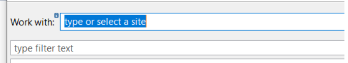
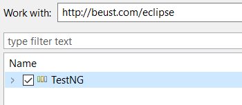
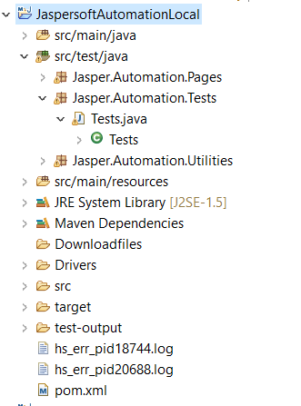
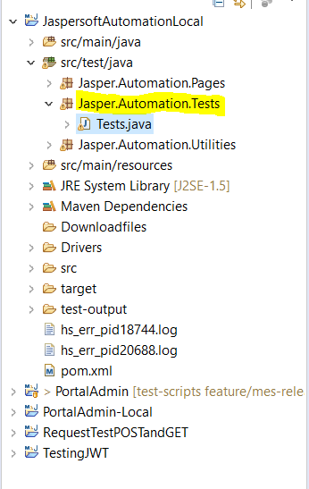
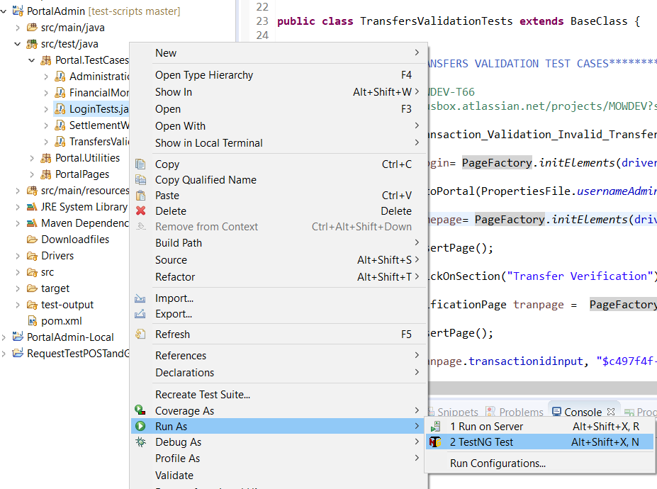

# Focus assesment - Selenium Tests

These are built in JAVA and we use Eclipse, Selenium, TestNG to work on them, please find below the
instructions about how to install all tools mentioned above to start using the Selenium tests

## Installation

   1. Clone this Repo to your local
   2. Download Eclipse [Link](https://www.eclipse.org/downloads/packages/installer)
   3. Install Eclipse
   4. Open Eclipse and go to Help option in top menu
   5. Click on install new software
   6. Enter url <http://dl.bintray.com/testng-team/testng-eclipse-release> in the ‘work with’ input box
  
   7. Eclipse will find TestNG click on check box and click next until installation complete
   
   8. Click on File menu, then click on Open Project from File System
   9. Navigate to the test project: \focus-test\JaspersoftAutomationLocal
   10. The project file will show up in the menu, select the file and open
   11. Project should be loaded in Eclipse 
  

## Usage

  1. Go to the Jasper.Automation.Tests package: \focus-test\JaspersoftAutomationLocal\src\test\java\Jasper\Automation\Tests
  
  2. Test can be executed by doing right click on the class name and then Run as: TestNG
  
  3. Check this video for reference <https://loom.com/share/694e804600ce4bd9814e16fb79b93399>

# Focus assesment - postman Tests

This ia a collection built in postman, download the colleciton and import from your postman

## Usage
   1. Clone this Repo to your local
   2. load postman collection and the environment file in your postman app 
      path: /focus-test/tree/main/postmantests
   3. Once collection and env files are loaded you can run each request one by one
   4. You can also run the whole collection using the postman test runner by doing right click on collection then "Run collection"
   5. Check this video for reference <https://loom.com/share/770882db7cac487490937ab018d59567>