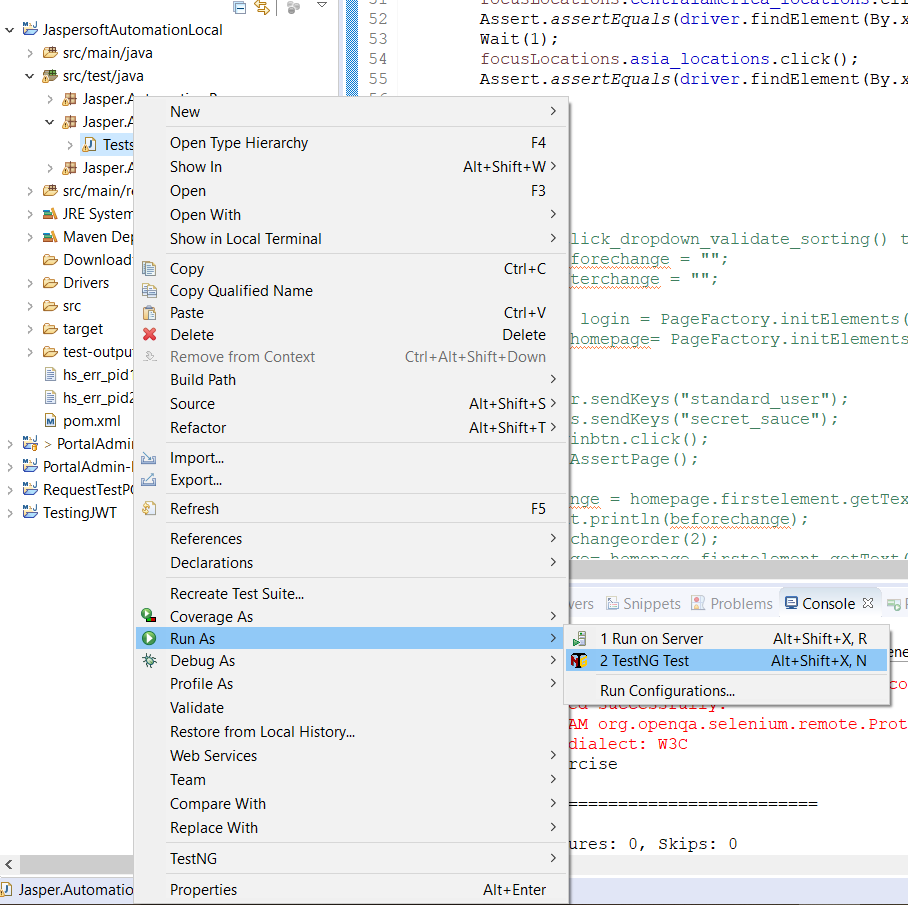

# Finance Admin Portal - Selenium Tests

These are the Portal Automated tests, they are built in JAVA and we use Eclipse, Selenium, TestNG to work on them, please find below the
instructions about how to install all tools mentioned above to start using the Selenium tests

## Installation

   1. Clone this Repo to your local
   2. Download Eclipse [Link](https://www.eclipse.org/downloads/packages/installer)
   3. Install Eclipse
   4. Open Eclipse and go to Help option in top menu
   5. Click on install new software
   6. Enter url <http://dl.bintray.com/testng-team/testng-eclipse-release> in the ‘work with’ input box
  
   7. Eclipse will find TestNG click on check box and click next until installation complete
   
   8. Click on File menu, then click on Open Project from File System
   9. Navigate to the Portal test project: \test-scripts\selenium\PortalAdmin
   10. The project file will show up in the menu, select the file and open
   11. Project should be loaded in Eclipse
   
   12. Depending on you setup you need to config the tests to run on your local, to do that follow next step
   13. In the project explorer go to test-scripts\selenium\PortalAdmin\src\test\java\Portal\Utilities\PropertiesFile.java
   
   14. The "env" and the "os", need to be change depending on the OS you have installed and the environment where you need
       to run the tests: env (dev,uat,stg) os (windows,mac,linux)
   15. Save changes made in file: test-scripts\selenium\PortalAdmin\src\test\java\Portal\Utilities\PropertiesFile.java
   16. Connect to the proper VPN depending on your choice on step 14 (dev,uat,stg)

## Usage

  1. Go to the Portal.TestCases package: test-scripts\selenium\PortalAdmin\src\test\java\Portal\TestCases
  
  2. Test Cases types available are: LoginTests, FinancialMonitoringTests, AdministrationTests, SettlementWindowsTests, TransfersValidationTests
  3. Each one of them can be executed by doing right click on the class name and then Run as: TestNG
  
  4. If a Test Report is needed then you can look for this file in the project: test-scripts\selenium\PortalAdmin\src\main\resources\testng.xml
  
  5. Do right click on this file and Run as: TestNG , this will execute all the tests in the Suite
  6. Once the execution is Done do right click on the Project name and click on "Refresh"
  7. Look for this file: test-scripts\selenium\PortalAdmin\test-output\Extent.html
  
  8. This "Extent.html" file can be open in a Web browser such as Chrome (open in file system first, then in Chrome) and all the informaiton regarding the test Execution will be listed: Passed tests, Failed tests, Test execution duration etc
  
